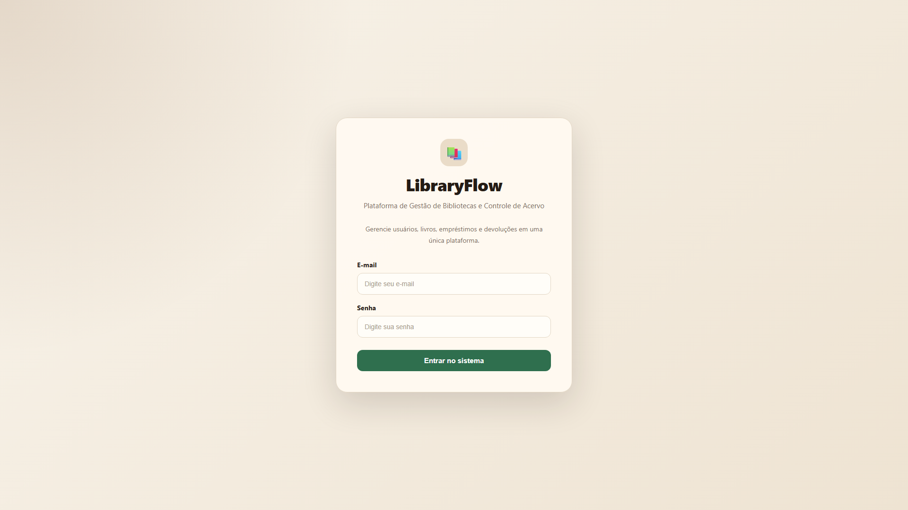
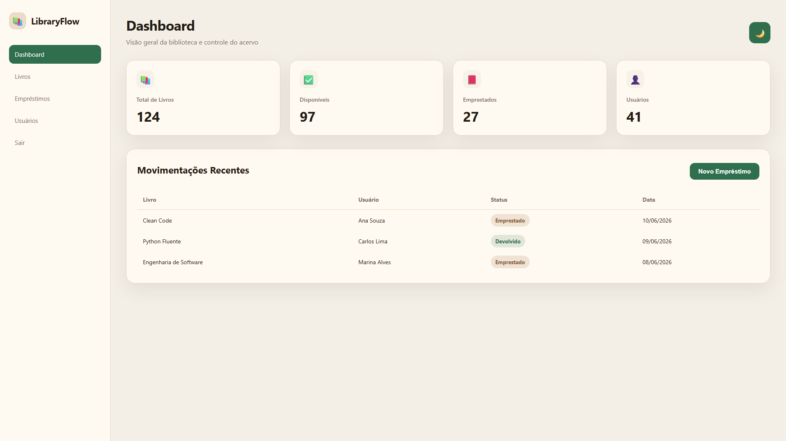
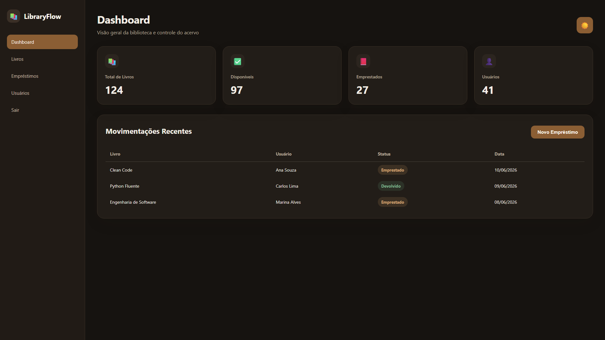

# 📚 LibraryFlow


Sistema web de gestão de bibliotecas desenvolvido com Python, FastAPI e SQLite.

**Versão Atual:** v2.2.0-beta

O LibraryFlow surgiu a partir da modernização de uma aplicação acadêmica originalmente desenvolvida em terminal (CLI), sendo posteriormente reestruturado para uma arquitetura web baseada em FastAPI, SQLAlchemy e SQLite.

O projeto tem como objetivo consolidar conhecimentos em desenvolvimento web, arquitetura de software, persistência de dados e construção de interfaces modernas.

---

# 📖 Visão Geral

O LibraryFlow centraliza o gerenciamento de bibliotecas em uma única plataforma, permitindo controlar o acervo através de uma interface intuitiva, responsiva e organizada.

Atualmente o projeto já possui persistência de dados, cadastro e remoção de livros, sistema de temas e interface administrativa funcional.

---

# 📸 Screenshots

## 🔐 Tela de Login



## ☀️ Dashboard — Tema Claro



## 🌙 Dashboard — Tema Escuro



---

# ✨ Funcionalidades

## 📚 Gestão de Acervo

* Cadastro de livros
* Listagem dinâmica de livros
* Persistência em SQLite
* Exclusão de livros
* Modal de confirmação de exclusão
* Toast de feedback para operações concluídas

## 🎨 Interface Moderna

* Tema claro
* Tema escuro
* Persistência de preferências via LocalStorage
* Interface responsiva
* Modais animados
* Feedback visual para ações do usuário

## ⚙️ Persistência de Dados

* Integração com SQLite
* SQLAlchemy ORM
* Camada de serviços
* Organização modular da aplicação

---

# 🖥️ Front-end Overview

### Tecnologias

* HTML5
* CSS3
* JavaScript
* Jinja2 Templates

### Componentes Atuais

* Tela de Login
* Dashboard
* Gestão de Livros
* Modal de Cadastro
* Modal de Confirmação
* Sistema de Toast Notifications
* Alternador de Tema

### Organização

```text
templates/
static/
├── css/
├── js/
└── images/
```

---

# ⚙️ Back-end Overview

### Tecnologias

* Python 3.13
* FastAPI
* SQLAlchemy
* SQLite

### Responsabilidades

* Gerenciamento de rotas
* Regras de negócio
* Persistência de dados
* Integração com banco de dados
* Renderização de templates

### Operações Implementadas

* CREATE Book
* READ Books
* DELETE Book

---

# 🏗️ Architecture

```text
Usuário
   │
   ▼
Templates (Jinja2)
   │
   ▼
FastAPI Routes
   │
   ▼
Services Layer
   │
   ▼
SQLAlchemy ORM
   │
   ▼
SQLite Database
```

## Camadas da Aplicação

### Presentation Layer

```text
templates/
static/
```

### Application Layer

```text
main.py
app/routes/
```

### Business Layer

```text
app/services/
```

### Data Layer

```text
app/models/
app/database/
```

---

# 🛠 Tecnologias Utilizadas

## Backend

* Python 3.13+
* FastAPI
* SQLAlchemy
* SQLite

## Frontend

* HTML5
* CSS3
* JavaScript
* Jinja2

## Controle de Versão

* Git
* GitHub

---

# 📁 Estrutura do Projeto

```text
libraryflow/
│
├── app/
│   ├── database/
│   ├── models/
│   ├── routes/
│   └── services/
│
├── database/
│   └── libraryflow.db
│
├── static/
│   ├── css/
│   ├── js/
│   └── images/
│
├── templates/
│
├── main.py
├── requirements.txt
└── README.md
```

---

# 🗺 Roadmap

## ✅ Concluído

* Estruturação da arquitetura web
* Interface de login
* Dashboard administrativo
* Sistema de temas claro e escuro
* Integração SQLite
* Integração SQLAlchemy
* Cadastro de livros
* Exclusão de livros
* Modal de confirmação
* Toast notifications
* Organização modular do CSS

## 🚧 Em Desenvolvimento

* Edição de livros
* Dashboard dinâmico
* CRUD de usuários
* CRUD de empréstimos

## 🔮 Futuro

* Controle de devoluções
* Histórico de movimentações
* Controle de multas
* Pesquisa avançada
* Relatórios administrativos
* API REST documentada

---

# 📊 Status

🟡 Em desenvolvimento ativo

Atualmente o projeto já possui persistência de dados funcional e CRUD parcial do acervo, com foco na implementação das operações restantes e dos módulos de usuários e empréstimos.

---

# 👨‍💻 Autor

**Arthur Almeida**

Projeto desenvolvido para evolução prática em desenvolvimento web, banco de dados, arquitetura de software e aplicações modernas.
