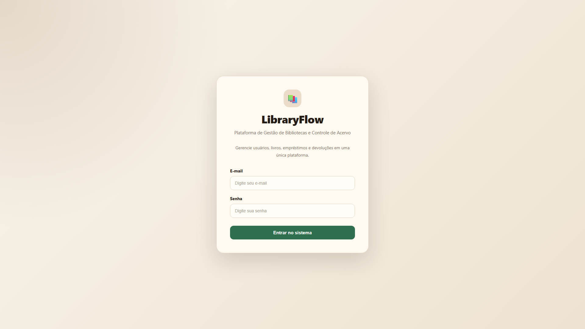
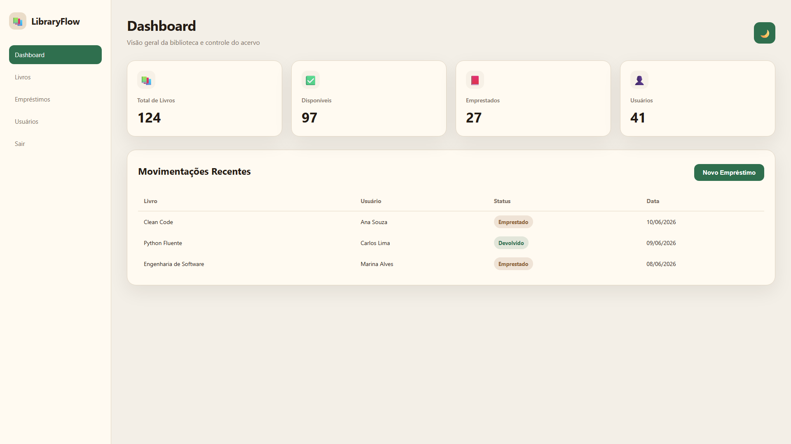
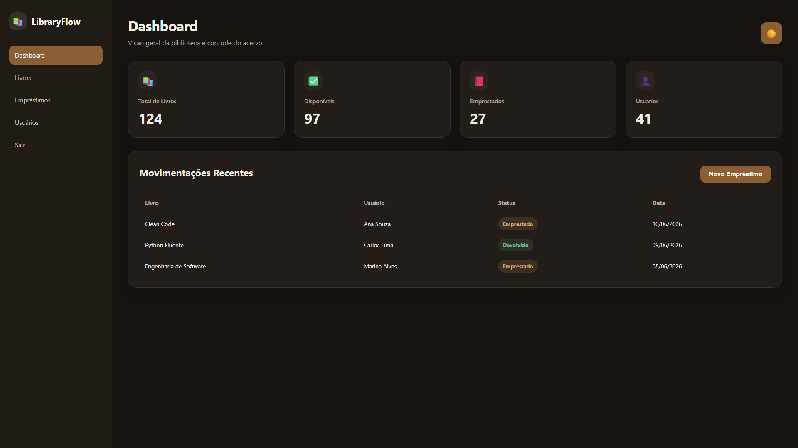

# LibraryFlow

Web-based library management system built with FastAPI, SQLAlchemy, and SQLite.


## Overview

LibraryFlow is a web application for library management, designed to manage bibliographic collections and provide a foundation for user, loan, and circulation workflows.

The project originated from an academic command-line application and was later redesigned as a web application using FastAPI. Its development focuses on software architecture, data persistence, system modeling, technical documentation, and incremental delivery.

LibraryFlow is currently in beta. The application includes a modular web architecture, complete book management, search capabilities, SQLite persistence, SQLAlchemy integration, an administrative dashboard, and light and dark themes.

**Current version:** `v0.5.0-beta`

## Screenshots

### Login



### Dashboard — Light Theme



### Dashboard — Dark Theme



## Features

### Book Management

- Create book records
- View the book collection
- Search the book collection
- Edit book information
- Delete book records
- Persist data with SQLite
- Manage database operations through SQLAlchemy ORM

### Interface

- Administrative dashboard
- Light and dark themes
- Responsive interface
- Interactive modals
- Notification system

### Application Structure

- FastAPI-based web application
- SQLAlchemy ORM
- SQLite database
- Jinja2 templates
- Modular organization
- Defined application layers

## Tech Stack

| Area | Technologies |
| --- | --- |
| Backend | Python 3.13+, FastAPI |
| Persistence | SQLAlchemy, SQLite |
| Templates | Jinja2 |
| Frontend | HTML5, CSS3, JavaScript |
| Version Control | Git, GitHub |

## Architecture

LibraryFlow follows a layered application structure that separates the web interface, routing, application services, persistence layer, and database.

```text
User
  │
  ▼
Jinja2 Templates
  │
  ▼
FastAPI Routes
  │
  ▼
Services Layer
  │
  ▼
SQLAlchemy ORM
  │
  ▼
SQLite Database
```

This separation keeps interface concerns, application logic, and persistence responsibilities organized as the project evolves.

For a detailed description of the architecture, see [`docs/architecture.md`](docs/architecture.md).

## Project Structure

```text
LibraryFlow/
├── app/
│   ├── database/
│   ├── models/
│   ├── routes/
│   └── services/
├── database/
├── docs/
│   └── use-cases/
├── static/
│   ├── css/
│   ├── images/
│   └── js/
├── templates/
│   └── partials/
├── main.py
├── requirements.txt
└── README.md
```

The project separates application logic, persistence, technical documentation, static resources, and server-rendered templates into dedicated directories.

## Getting Started

LibraryFlow requires Python 3.13 or newer.

Clone the repository:

```bash
git clone https://github.com/arthurcfranklin/libraryflow.git
cd libraryflow
```

Create and activate a virtual environment, then install the project dependencies according to the repository configuration.

Detailed environment and setup instructions are available in [`docs/setup.md`](docs/setup.md).

## Documentation

Technical documentation is maintained in [`docs/`](docs/) and evolves alongside the application.

| Document | Description |
| --- | --- |
| [Architecture](docs/architecture.md) | Application architecture and structural decisions |
| [Requirements](docs/requirements.md) | Functional and non-functional requirements |
| [Business Rules](docs/business-rules.md) | Business rules implemented by the system |
| [Use Cases](docs/use-cases/use-cases.md) | System use cases and related workflows |
| [Database](docs/database.md) | Data model and persistence documentation |
| [API](docs/api.md) | API and application interface documentation |
| [Design](docs/design.md) | Interface and design specifications |
| [Setup](docs/setup.md) | Development environment and application setup |
| [Troubleshooting](docs/troubleshooting.md) | Known issues and troubleshooting procedures |
| [Changelog](docs/changelog.md) | Project change history |
| [Roadmap](docs/roadmap.md) | Planned project evolution |
| [Contributing](docs/contributing.md) | Development and contribution guidelines |

## Releases

| Version | Milestone |
| --- | --- |
| `v0.1.0-alpha` | Initial Web Architecture |
| `v0.2.0-alpha` | Dashboard and Theme System |
| `v0.3.0-alpha` | Books Management Foundation |
| `v0.4.0-beta` | Complete Books CRUD |
| `v0.5.0-beta` | Documentation and Governance Framework |

## Roadmap

### Completed

- [x] Web architecture
- [x] Administrative dashboard
- [x] Theme system
- [x] Complete books CRUD
- [x] SQLite persistence
- [x] SQLAlchemy integration
- [x] Modular application structure
- [x] Technical documentation
- [x] Release workflow
- [x] Project governance

### `v0.6.0-beta` — Users Management

- [ ] Create users
- [ ] View users
- [ ] Edit users
- [ ] Delete users

### `v0.7.0-beta` — Loans Management

- [ ] Loans
- [ ] Returns
- [ ] Availability control

### `v0.8.0-beta` — Authentication

- [ ] Authentication
- [ ] Session management
- [ ] Route protection

### `v0.9.0-beta` — Administration

- [ ] Administrative reports
- [ ] Audit capabilities
- [ ] Management features

### `v1.0.0`

- [ ] Stable release

## License

LibraryFlow is distributed under the [MIT License](LICENSE).

---

Developed by **Arthur Franklin** · [Português](README.pt-BR.md) · [MIT License](LICENSE)
